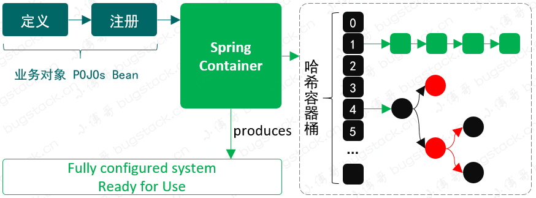
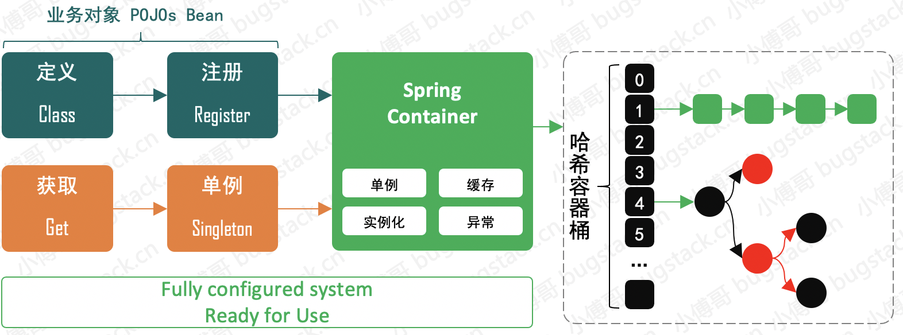

# sty-spring-code
手撸spring源码

第一节-创建简单的bean容器

定义：BeanDefinition，可能这是你在查阅 Spring 源码时经常看到的一个类，例如它会包括 singleton、prototype、BeanClassName 等。但目前我们初步实现会更加简单的处理，只定义一个 Object 类型用于存放对象。
注册：这个过程就相当于我们把数据存放到 HashMap 中，只不过现在 HashMap 存放的是定义了的 Bean 的对象信息。
获取：最后就是获取对象，Bean 的名字就是key，Spring 容器初始化好 Bean 以后，就可以直接获取了。

第二节-实现 Bean 的定义、注册、获取   

首先我们需要定义 BeanFactory 这样一个 Bean 工厂，提供 Bean 的获取方法 getBean(String name)，之后这个 Bean 工厂接口由抽象类 AbstractBeanFactory 实现。这样使用模板模式 (opens new window)的设计方式，可以统一收口通用核心方法的调用逻辑和标准定义，也就很好的控制了后续的实现者不用关心调用逻辑，按照统一方式执行。那么类的继承者只需要关心具体方法的逻辑实现即可。
那么在继承抽象类 AbstractBeanFactory 后的 AbstractAutowireCapableBeanFactory 就可以实现相应的抽象方法了，因为 AbstractAutowireCapableBeanFactory 本身也是一个抽象类，所以它只会实现属于自己的抽象方法，其他抽象方法由继承 AbstractAutowireCapableBeanFactory 的类实现。这里就体现了类实现过程中的各司其职，你只需要关心属于你的内容，不是你的内容，不要参与。这一部分内容我们会在代码里有具体的体现
另外这里还有块非常重要的知识点，就是关于单例 SingletonBeanRegistry 的接口定义实现，而 DefaultSingletonBeanRegistry 对接口实现后，会被抽象类 AbstractBeanFactory 继承。现在 AbstractBeanFactory 就是一个非常完整且强大的抽象类了，也能非常好的体现出它对模板模式的抽象定义。接下来我们就带着这些设计层面的思考，去看代码的具体实现结果

第三节-基于Cglib实现含构造函数的类实例化策略
主要解决什么问题？
如何实例化一个含有构造函数的的对象

java.lang.InstantiationException: cn.bugstack.springframework.test.bean.UserService

	at java.lang.Class.newInstance(Class.java:427)
	at cn.bugstack.springframework.test.ApiTest.test_newInstance(ApiTest.java:51)
	...

发生这一现象的主要原因就是因为 beanDefinition.getBeanClass().newInstance(); 实例化方式并没有考虑构造函数的入参

解决方案：
参考 Spring Bean 容器源码的实现方式，在 BeanFactory 中添加 Object getBean(String name, Object... args) 接口，这样就可以在获取 Bean 时把构造函数的入参信息传递进去了。
另外一个核心的内容是使用什么方式来创建含有构造函数的 Bean 对象呢？这里有两种方式可以选择，一个是基于 Java 本身自带的方法 DeclaredConstructor，另外一个是使用 Cglib 来动态创建 Bean 对象。Cglib 是基于字节码框架 ASM 实现，所以你也可以直接通过 ASM 操作指令码来创建对象
